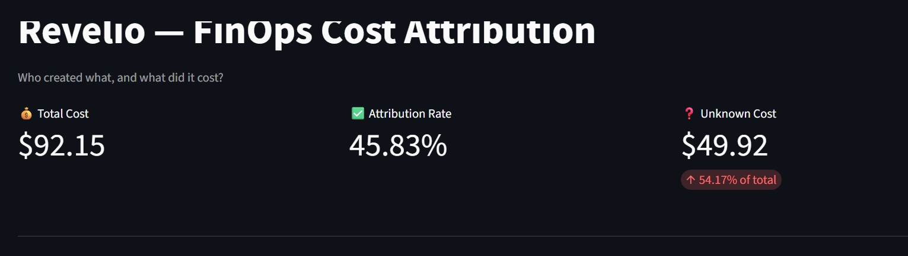
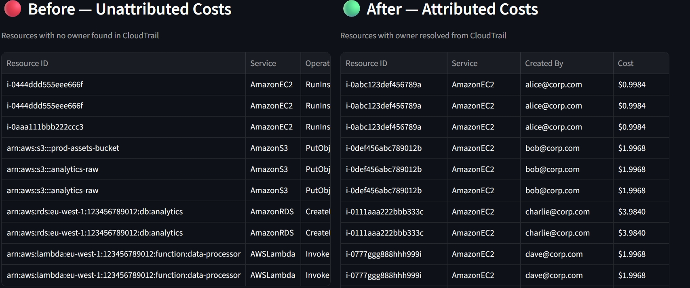
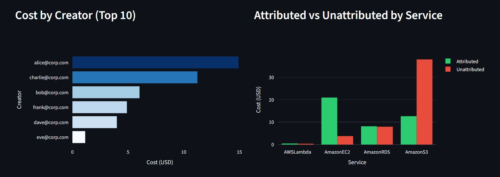

# Revelio — Cloud Cost Intelligence & FinOps Attribution Engine

---

## Business Context

In AWS environments, a significant portion of cloud spend cannot be attributed to teams or individuals due to:

- missing or incorrect tags
- ephemeral infrastructure (Lambda, ECS, autoscaling)
- shared infrastructure (NAT, RDS, EKS nodes)
- CI/CD and assumed-role executions

This leads to **"dark cost"** — cloud spend that Finance cannot allocate or recover.

> In practice, 30–60% of AWS costs are often partially or fully untraceable.

---

## 🎯 Business Objective

Revelio is a FinOps attribution engine that reconstructs cloud ownership using audit logs instead of tags.

It enables organizations to:

- Attribute AWS spend to real IAM identities
- Recover unallocated or "dark" cloud costs
- Improve chargeback accuracy beyond tagging limitations
- Build identity-based cost transparency for FinOps teams

---

## 💡 Key Business Outcomes

### 1. Recovery of Unallocated Cloud Spend

Instead of relying on tags, Revelio correlates:

- **AWS CUR** — cost data per resource
- **CloudTrail** — who created what
- **AWS Config** — fallback metadata

→ Enables attribution of previously "unallocated" spend.

### 2. Identity-Based Cost Attribution

Every resource cost is linked to:

- IAM user
- IAM role (CI/CD pipelines)
- Session identity (assumed roles)

→ Moving from **"tag-based FinOps"** to **"identity-based FinOps"**

### 3. Visibility of Hidden Cost Drivers

Revelio surfaces:

- top cost-generating engineers
- CI/CD pipelines responsible for infrastructure cost
- unmanaged shared resource spend

### 4. Audit-Ready Financial Transparency

Creates a historical, queryable dataset of:

- resource → cost → creator mapping
- attribution confidence scoring
- cost ownership lineage

---

## 📊 FinOps KPIs

| KPI | Description | Business Impact |
|-----|-------------|-----------------|
| **Attributed Spend %** | % of total AWS cost linked to identity | increases financial visibility |
| **Dark Cost Reduction** | Reduction of unassigned spend | waste recovery |
| **Attribution Confidence** | % HIGH / MEDIUM / LOW mappings | data reliability |
| **Shared Cost Leakage** | Unfair allocation from shared infra | fairness improvement |
| **Cost per Identity** | spend per engineer / role | accountability |

---

## 📊 Dashboard Preview

**KPI Overview — Attribution Rate & Dark Cost**



**Before / After — Unattributed vs Attributed Resources**



> Left: resources with no owner in CloudTrail. Right: same resources with IAM identity resolved.

**Cost by Creator & Attribution Gap by Service**



---

## 🏗️ Architecture Overview

Revelio is a fully serverless cloud cost intelligence pipeline:

```
AWS CUR          → cost ingestion layer
CloudTrail       → identity & action tracking
AWS Config       → structural fallback mapping
AWS Glue (PySpark) → correlation engine
Athena           → queryable FinOps data layer
S3               → cost data lake storage
```

---

## 🧠 Core Innovation

Instead of relying on tags, Revelio uses **CloudTrail as the source of truth for ownership**.

Mapping logic:

| CloudTrail Event | Attribution |
|-----------------|-------------|
| `RunInstances` | IAM identity |
| `CreateDBInstance` | role or user |
| CI/CD assumed roles | `sessionIssuer` |
| Config metadata | fallback resolution |

---

## 📈 Attribution Confidence Model

| Level | Meaning |
|-------|---------|
| **HIGH** | Direct IAM-to-action mapping via CloudTrail |
| **MEDIUM** | Reconstructed via AWS Config relationships |
| **LOW** | No historical trace (legacy or pre-trail resources) |

---

## ⚙️ Cost & Fault Design

**Serverless Cost Model**
- Glue + Athena + S3 only
- No always-on compute

**Fault Strategy**
- No retries on Glue jobs — prevents compute cost explosion on corrupted data
- Fail-fast + human-in-the-loop recovery
- Previous dataset remains queryable in S3

→ This is **cost-aware system design**, not just engineering.

---

## 🔁 Data Flow

```
CUR (cost data)
CloudTrail (identity logs)       →  PySpark correlation engine
AWS Config (metadata fallback)   →  Athena analytical layer
                                 →  FinOps dashboards
```

---

## 🚀 Business Value

This system enables organizations to move from:

> *"We think we know who is spending what"*

to:

> *"We can prove who created every dollar of cloud cost"*

---

## 💼 Why this project matters

This project demonstrates:

- advanced FinOps cost intelligence (beyond tagging)
- AWS data lake architecture (CUR + CloudTrail + Athena)
- identity-based cost attribution model
- real-world chargeback system design
- cost observability at engineering-level granularity
